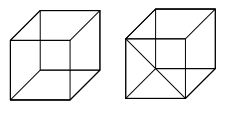
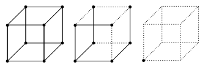
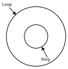
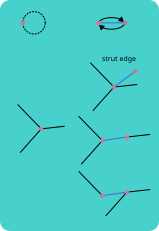
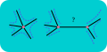
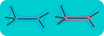
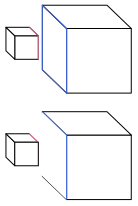
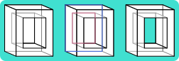

# Euler Operations

Now we can finally move on to define exactly how we can construct objects
from plane models.

## "Local" Topological Operations

These are operations that don't alter the global topological properties of the model
(does not create new holds or tears or rips), thus the name "local" topological operations.

### The Skeletal Plane Model

Here is an interesting thought: recall the [invariance theorem](plane_models.md#the-invariance-theorem),
which states that the Euler characteristic remains constant regardless of the chosen plane model 
representing a the same underlying surface. Let's think about splitting a face by adding an edge across it:

If you confirm manually, you will see that indeed the Euler characteristic remains constant. 

Then, it is not unreasonable to think that removing an edge from a face or joining two faces will preserve the Euler characteristic.

The idea here is that we can repeatedly join faces until we end up with only one vertex and one face.

In the illustration above, edges (solid black lines) are removed and only the outline of the face (dotted lines) 
are left, and in the very end, only one vertex and a face that is shaped like a cube remains. Don't worry if
this doesn't seem to make sense, it is indeed quite unintuitive.

Try checking if the invariance theorem holds (it should!). Therefore, any plane model without a "hole" (of genus 0)
can be reduced to a plane model with one vertex and one face, which is known as the **skeletal plane model**.

The siginificane of the skeletal plane model lies in how **splitting a face is the inverse of joing two faces**,
meaning *we can construct any plane model of genus 0 by performing face splitting and joining operations on a skeletal plane
model!*

## "Global" Topological Operations

These are operations that DO alter the global topological properties of the model
(creates new holds or tears or rips), thus the name "global" topological operations.

### Connected Sums

Here we introduce the "cut and paste" operation, where a disk is cut from two surfaces 
and their edges are joined. The result of this operation is called a *connected sum*.

You can perfrom the operation on the same object to increase its genus (too lazy to
draw diagram, sorry lol).

### Connected Minus

This is the inverse of the connected sum, where we split surface into two and fill in the hole.

With these operations, it is possible to create any object of any genus through a finite number of them a number of skeletal plane models. Pretty cool, right?

# Euler Operators

In order to discuss the details of what will be our basic operators (Euler operators),
we will need to discuss what our data structure will actually look like.

GWB uses what is known as a "half-edge data structure", and while the details for this
are saved for the [next section](half_edge_data_structure.md), here is what you need
to know for now:

Half-edge data structures have:

- Vertices
- Edges
- Loop: edges that start and end at the same vertex. Referred to as rings for internal loops
    
- Face
- Shell: a surface of connected faces

The book describes these operations using abbreviations like MVFS for "Make Vertex Face Solid".
This is one point where I will diverge from the book as I think this is confusing and rather cryptic, 
so I will simply write them with plain English.

Operations that instantiate and delete objects (solids) will use the words *new* and *delete*, whereas
operations that modify existing objects will use the words *add* and *remove* instead.

## Skeletal Primitives

### New Skeletal Primitive (New Vertex and Face Solid)

This operator creates a new skeletal primitve with one vertex and one face.
The face has one empty loop with no edges.

### Delete Skeletal Primitive (Delete Vertex and Face Solid)

The operator is the inverse of `Create Skeletal Primitive` and will only delete
objects with the same data structure as a skeletal primitive.

## Local Manipulations

### Split Vertex (Add Edge and Vertex)

This operator splits a vertex into two and joins them with a new edge, or more
accurately subdivides a loop of edges. Think of it as adding a new
vertex to an existing loop.

However, it is important to consider the case where many edges are incident at the
vertex. Which edges should be reassigned to the new vertex?

Because of this ambiguity, three parameters are needed for this operator:

- The vertex to split
- The location of the new vertex
- Which edges to reassign to the new vertex

We also need to think about the case where *no* edges are to moved into new vertex,
ie a "strut" edge.

And finally, there is the question of which loops the newly created half-edges will 
be inserted into. Consider the following diagram:

How do we assign the loops to the newly created edge?

To us, it seems pretty obvious that the diagram on the left is the right answer.
In case you are confused, the diagram on the right treats the 

This is solved by treating the "edges to reassign to the new vertex"
input as a **range** instead of a list. 

### Collapse Edge (Remove Edge and Vertex)

This operator is the inverse of the `Subdivide Loop` operator. It joins
two connected vertices in a loop and removes the edge between them, merging their edge cycle.

### Split Face (Add Edge and Face)

This operator subdivides a loop by joining two vertices with a new edge, and adding a new face.

This operator can also do something a bit freaky: Add a "circular" edge that starts and ends at the
same vertex and fills it with a face. Once you think of it as splitting the face that comes with a
skeletal primitive into two, it starts to make a bit more sense.

Again, it's good to remind ourselves that these operations are purely topological and as such, will sometimes
make no sense.

### Join Face (Remove Edge and Face)

This is the inverse of `Join Face`: it joins two distinct adjacent faces by removing the edge between them
and merging their loops.

### Split Ring from Loop (Remove Edge and Create Ring)

This operator splits a loop into two by removing an edge that appears *twice* in it. See illustration:

Note that this can also result in a case where you get two empty loops after the operation.

In the illustration above, a loop is formed from two edges which overlap each other. After the operation,
the edges are removed, resulting in no remaining edges in the two new loops.

### Join Ring with Loop (Add Edge and Remove Ring)

This is the inverse of `Split Ring from Loop` and joins two loops by adding two edges in between them.

## Global Operators

### Connected Sum (Remove and Create Ring from Face)

This operator works by removing a face and turning its loop into a ring of another face.

It can do two things:
- Join two objects into one
    
- Create a hole in an object
    
    (a teal backdrop is added to make the hole visible on a white backdrop)

### Connected Minus (Remove and Create Face from Ring)

This is the inverse of the `Connected Sum`, and works by "tearing" the ring of a face
out and filling it with a new face.