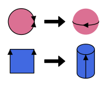
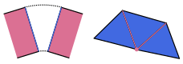
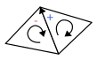
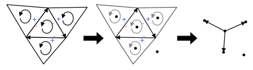

# Plane Models

The goal of a solid modeler is modeling 2-manifolds.
2-manifolds are basically solids that are not "weird", basically
if you took a solid, rounded out its sharp corners and edges and pretended you
were an ant walking on the surface of this rounded out object, you
would see that the ground is connected all around you.

Consider two infinitely pointy needles meeting each other at the tip.
Are they connected or not? How would you round it out? 2-manifolds
ensure solids aren't "weird" in this way, as you would not be able to
treat two touching needles as one solid (instead you would need to treat
them as two separate solids for this to comply with the definition of a
2-manifold, which makes sense because such an object can't exist in reality!).

2-manifolds are quite vague. One way to reason about them is through the use of plane models.

Plane models are **abstract** mathematical objects which are a subset of
surface models (b-rep). Plane models are the *theoretical* part of
GWB and should not be confused with half-edge data structures, which is one 
realization of the plane model.

## Topology

So here's the main question: how do we make a 2-mainfold in a way that we
can realistically represent? How do we reason about their properties? 

We mainly care about the topology of a solid here. That is, we are allowed
to freely stretch and mold a solid as long as we tear or rip it, and we 
are interested in objects that are "topologically equivalent". For example,
a cube can be formed into a sphere, and so can a cylinder, therefore
a cube is topologically equivalent to a cylinder.

The idea is: how do we construct an object that is topologically equivalent
to any 2-manifold? If we can come up with such a method, then mathematically
we would be able to construct any 2-manifold using that method!

Here is where the plane model comes in handy.

The idea is that we can construct any topology by joining the edges of a planar surface.

For example, consider this:

A sphere can be formed by joining the edge of a circle with itself. An
open cylinder can be formed by joining the two opposite of a square.
You could even form a torus from the open cylinder by joining the edges
of the open ends of the cylinder! All this from a simple plane.

In this way, we can construct any solid we want through the joining, more 
accurately the **identification** of edges of planes!

Or to put it neatly:

> The surface of a solid can but modeled in terms of a planar graph with special topology,
> and based on the graph, we can deduce properties about it from the topology.

## Identification 

As a reminder, identification here essentially means joining.

Without going into the formal definition,
identifying two edges means treating the edges as the same.
Likewise, identifying vertices mean treating them as a single point,
and in both cases, their neighborhoods are considered connected.

## Definition of a plane model

The precise mathematical definition of a plane model can be quite confusing
for those unfamiliar with graph theory and topology, of which I am a part of.

So I will first describe it simply then try to define it as rigirously as reasonable.

A plane model is defined as a collection of *finite* vertices, edges, and
polygons which are bounded by said edges and vertices. There are a few restrictions:
edges have directions cannot cross each other (this is known as a planar directed graph),
and polygons have orientation.

Each edge, vertex, and polygon is labeled, and they are identified when their labels are the same.

## Conditions for realizable plane models

A plane model is not neccessary a 2-manifold. We need to impose a few more rules
to ensure they are 2-manifolds.

### Surface subdivision

A surface subdivision is defined as a plane model where

- Every edge is identified with exactly one other edge
- Polygons sharing identified vertices are arranged in a continuous cycle and
  the shared edge between any two polygon must be adjacent to an identified vertex

   
A surface subdivision satisfies the requirements of a 2-manifold.

Still, we are able to create impossible objects such as the Klein bottle.
To address this, we introduce the concept of orientability

### Orientability (Möbius's rule)

A plane model is *orientable* when we choose an orientation for all polygons and
for each pair of identified edges, one edge is in the "negative" direction and the other
is in the "positive" direction. This is best described with an illustration:

In the illustration above,  the two polygons are given the same orientation and are
identified at an edge whose direction is given by the black arrow. In the left
polygon, the direction of the edge is going against the orientation of the polygon,
therefore having a negative direction and vice verse in the right triangle. The above
example satisfies the conditions, and thus we can say it is orientable.

# Properties of plane models 

Here are a few useful properties of plane models.

## The invariance theorem

Plane models of the same surface have the same *Euler characteristic*, given as
\\[  \chi = v - e + f \\]
where \\( v \\), \\( e \\), and \\( f \\) which are the number of vertices, edges,
and faces respectively.

## Euler-Poincaré formula

Another way to write the above equation is
\\[ \chi = b_0 - b_1 + b_2 \\]
where \\( b_0 \\), \\( b_1 \\), and \\( b_2 \\) are referred to as the *Betti numbers*,
and represent the number of connected components, the number of "circular" holes, and 
the number of "cavities" respectively.

For now you don't need to understand them; just know that they exist and that they stay constant
regardless of representation if the underlying surface is the same.

# Duals

One more useful tool for reasoning about plane models are *duals*. The idea of a dual
is that by turning polygons into vertices and joining them with an edge where polygons are joined,
you can construct an object with the "same" properties. 

Let's describe this in a bit more detail before discussing how this is useful.

When we construct the dual of a plane model, we assign a dual vertex to each polygon.
Connected polygons are joined together via an edge between their dual vertices. This is best
described with an illustration:

Note that one additional vertex for the infinite surrounding is included.

There is also one more rule for conserving orientation:

- The direction of the dual edge goes from the dual vertex of the polygon whose identified edge direction
  is negative to the dual vertex of the polygon whose identified edge direction is positive 

It offers a different view into the topology of a plane model. Say you wanted to know which faces are connected
to a particular face of interest. This can get confusing if your model is complicated, but looking at its
dual gives you the answer instantly.

Interestingly, applying the dual twice will give you back your original plane model!
